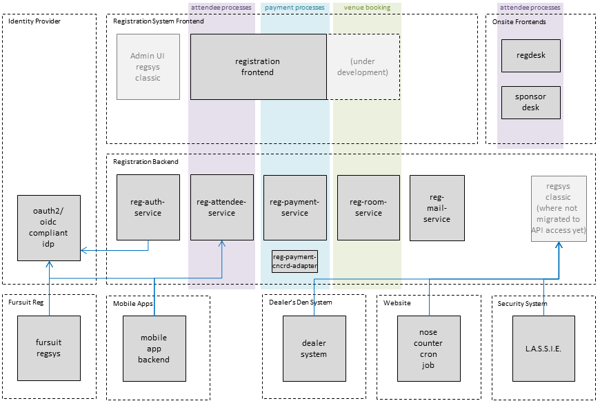

# eurofurence-registration-system

## Overview

A helm chart that can deploy the Eurofurence Registration System.

The Eurofurence Registration System is Open Source software,
all major components are [MIT licensed](https://github.com/eurofurence/reg-helm-chart/blob/main/LICENSE).

| Component                                                                                                                             | Description                                                                               |
|---------------------------------------------------------------------------------------------------------------------------------------|-------------------------------------------------------------------------------------------|
| [Helm Chart](https://github.com/eurofurence/reg-helm-chart)                                                                           | helm chart used to deploy the registration system                                         |
|                                                                                                                                       |                                                                                           |
| [Attendee Service](https://github.com/eurofurence/reg-attendee-service)                                                               | backend micro-service providing a central attendee-related REST API                       |
| [Auth Service](https://github.com/eurofurence/reg-auth-service)                                                                       | backend micro-service that bridges registration and the identity provider                 |
| [Mail Service](https://github.com/eurofurence/reg-mail-service)                                                                       | backend micro-service for rendering mails based on templates and sending them             |
| [Payment Service](https://github.com/eurofurence/reg-payment-service)                                                                 | backend micro-service for dues and payments booking and accounting                        |
| [Room Service](https://github.com/eurofurence/reg-payment-service)                                                                    | backend micro-service for rooms, roomgroups, and hotel booking                            |
|                                                                                                                                       |                                                                                           |
| [Concardis Adapter](https://github.com/eurofurence/reg-payment-cncrd-adapter)                                                         | backend micro-service that interfaces between the registration system and the Paylink API |
|                                                                                                                                       |                                                                                           |
| [Frontend](https://github.com/eurofurence/reg-frontend) and [Component Library](https://github.com/eurofurence/reg-component-library) | Frontend and component library for end user registration                                  |
| [Onsite UI](https://github.com/eurofurence/reg-onsite-ui)                                                                             | UI used by the onsite registration team                                                   |
| [Regsys Classic](https://github.com/eurofurence/reg-regsys-classic)                                                                   | Admin UI (and what's left of the regsys we used in the years 2001-2019)                   |

The Eurofurence Registration System depends on the [Eurofurence Identity Provider](https://github.com/Thiritin/identity),
which is also Open Source software (Apache 2.0).

## Configuration

See [values.yaml](values.yaml) for pre-configured defaults.

See [values-example.yaml](values-example.yaml) for a starting point of what you would put in your `values.yaml`
when using this helm chart.

All fields of the configuration have descriptions in the [JSON schema](values.schema.json), so you can
use a smart editor to get help with the configuration.

## Manual secret configuration

Using kubectl, create a secret (not managed by argocd):

```
apiVersion: v1
kind: Secret
metadata:
  name: regsys-secret
  namespace: <PUT_YOUR_NAMESPACE_HERE>
data:
  # these are example values, they all say "demo". Edit and then manually create the secret using kubectl,
  # or use something like vault or the external-secrets-operator.
  REG_SECRET_API_TOKEN: ZGVtbw==
  REG_SECRET_DB_PASSWORD: ZGVtbw==
  REG_SECRET_DD_TOKEN: ZGVtbw==
  REG_SECRET_ARTSHOW_TOKEN: ZGVtbw==
  REG_SECRET_BOAT_TOKEN: ZGVtbw==
  REG_SECRET_CONCARDIS_API_SECRET: ZGVtbw==
  REG_SECRET_CONCARDIS_INCOMING_WEBHOOK_SECRET: ZGVtbw==
  REG_SECRET_NOSECOUNTER_TOKEN: ZGVtbw==
  REG_SECRET_OIDC_CLIENT_ID: ZGVtbw==
  REG_SECRET_OIDC_CLIENT_SECRET: ZGVtbw==
  REG_SECRET_SECU_TOKEN: ZGVtbw==
  REG_SECRET_SECU_SECRET: ZGVtbw==
  REG_SECRET_SMTP_PASSWORD: ZGVtbw==
```

The values can be base64 encoded using `echo -n 'some secret value' | base64`.

## Documentation

### Architecture Overview



### Business Architecture

#### Identity Provider

Provided by our IT department as a service to registration, this OpenID Connect compliant OAuth2 provider is
the single source of truth for authentication ("who am I") as far as registration is concerned. It
provides standard JWT tokens that are verified by every registration software component, and handles account 
creation, login/logout, password forgotten, email verification.

While some additional information related to authorization are collected and provided as part of the token, 
such as "is staff" or "is a director", registration handles authorization internally.

#### Processes supported by manual exports

* Badge printing uses excel exports and a standalone software solution called Bartender that handles the graphical design
* various other departments use csv / excel exports

#### onsite frontends

The **registration desk** allows onsite reg helpers to log in and out, search for attendees by badge number, nickname or
name, and to process their check in, provided there are no outstanding dues. It is a static Nuxt web application
optimized for ease of use when working through the registration queue with many agents in parallel. It is mostly used on
mobile devices or laptops.

Login is provided by the IDP, all other backend functions are provided by the attendee service.

The **sponsor desk** allows onsite shop helpers to log in and out, search for sponsors and supersponsors by badge
number, nickname or name, and to mark that they have received their sponsor gifts. It is a static web application
optimized for ease of use when working through the sponsors queue with multiple agents in parallel. It is mostly used on
mobile devices or laptops.

Login is provided by the IDP, all other backend functions are provided by the attendee service.

#### regsys classic

Regsys classic is now just the Admin UI. Based on the original version of the registration system before the move
to the new service architecture, it no longer has a database, just acts as a UI for all staff / admin functions,
accessing the backend services. Authentication is done using the IDP. As described
in the other sections, all external interfaces and exports are to be relegated to the services backend.

If all functionality is ever migrated into the new world, this component can be removed. It is however likely that this
will take a long time, if it ever happens. For admins / staff, visual beauty is not so much a concern, and we can even
live with some usability limitations. Also, it is not a concern that the regsys classic is single-language (English and
German supported via global feature toggle). Besides, the large amount of extra fields and functionality may well be
unsuitable for a mobile-first designed UI.

Until the export service will be added, regsys classic also provides a compatibility layer for some existing bespoke
interfaces.

#### auth service

Not all users of the registration system will have an OIDC identity provider at their disposal, especially during local
development.

If an OIDC Provider is available, this service provides a backend component running under the domain of the registration
system that is involved in oidc compliant login/logout flows and back-channel logout notifications. It holds the client
id and client secrets and can set cookies for the registration system domain(s).

Admin functionality in regsys classic will query this service for the detailed admin permissions, when this is done it
will query the IDP id endpoint to ensure a current session is available and the staff role has not been revoked in the
meantime.

#### attendee processes

This front-to-back column provides everything related to attendee management:

* creating and editing registrations
* adding and removing packages incl. calculating total due amount (but not current dues)
* searching and listing registrations
* registration status progression (received - unconfirmed - new - accepted/approved - partially paid - paid - arrived -
  checked in - waiting - cancelled - deleted)
* ban detection
* transferring registrations when re-sold

Initially the frontend will concentrate on **end user functionality**, while all staff functionality is provided by
regsys classic acting as a legacy frontend to the backend services. This means that the available interface nicely
reduces to operations on a single registration.

* initial reg
* self-service viewing and editing registration data
* self-service changing packages
* (potentially self-service) transferring registration
* (potentially self-service) cancelling a registration

[reg-attendee-service OpenApi v3 Spec](https://github.com/eurofurence/reg-attendee-service/blob/main/api/openapi-spec/openapi.yaml)

#### payment processes

This front-to-back column provides everything related to payments and accounting.

* Calculate current dues
* Register receivables and payments
* Payment status management (pre-pending - pending - valid - deleted)
* Payment processor(s) backend / state handling
* Money transfer info
* Accounting reports
* Note that status transitions are handled by the attendee service to keep this functionality in a single place

Initially the frontend will concentrate on **end user functionality**, while all staff functionality is provided by
regsys classic acting as a legacy frontend to the backend services. This means that the available interface nicely
reduces to operations on a single registration.

* view my payment history
* view my dues history
* perform payment using a credit card / girovend processor for the current due amount
* obtain money transfer information (e.g. for MMC)

#### venue booking

(under development)

The registration system aims to support 4 modes of operation where hotel/room booking is concerned:

* Self booking: Attendees book a room directly but receive some assistance from our system,
  e.g. a secret code word and/or help with formulating an e-mail.
* Reseller model: The convention acts as a reseller for hotel rooms.
* Youth Hostel model (currently used by MMC): Registration includes a bed in the hostel, the system limits the
  amount of registrations that can be accepted to the number of available beds, although there can be packages for
  non-residential attendance. There is self-service functionality in the registration system for forming room groups,
  inviting other attendees into a group, kicking someone from a group, handing over group leadership. For admins there
  is functionality to create and manage rooms and assign attendees to them. This assignment is a manual process in the
  registration system, done by an admin.
* No Hotel model: There is an optional information page, and even that can be turned off. Intended for day events
  or small events.

While the backend service will support all this functionality, the frontend can currently focus on
the Youth Hostel model only, since EF needs no hotel booking and MMC uses this model.

#### mailings

The registration system sends some standardized mails, rendered from templates:

* please pay
* please pay - partially paid version
* please pay - overdue version with cancel warning
* thank you for paying
* your registration has been cancelled
* you have been granted guest status
* you have been placed on the waiting list
* ... some mails related to room groups

All these mails are currently available in 2 languages, so the backend service supports supplying templates in
multiple languages.

Staff with the proper rights may also save their own templates and send announcements to a filtered selection of
attendees. Again, the backend service supports supplying templates in multiple languages, so we can stop doing
the "DEUTSCHE ÜBERSETZUNG s.u." / "See below for English" nonsense.

All emails, custom or standard, can include/use the following values:

* badge number
* nickname
* total dues
* remaining dues
* due date
* confirm link (likely to no longer be needed)
* initial password (likely to no longer be needed)
* new email address to confirm (likely to no longer be needed)
* sender email
* target email
* reply-to email

Attendee data is provided by the attendee service, which calls the mailing service, providing the
template fields in a standard data structure.

It would also be good to include email logging and possibly bounce mail handling, so EF doesn't get put on black lists
anymore.

Another area of active development is support for more modern templates and attachments.

For now, all mailing functionality uses regsys classic as its frontend, except for mails triggered by status
transitions from the attendee service directly.

### Software Architecture

Our code is MIT licensed Open Source software hosted on our GitHub account, using a modern architecture clearly
separated into multiple areas of front-to-back responsibilities, each supported by a small number of services in the
backend.

#### Backend Services

Our backend services are written in [golang](https://golang.org/) using the [chi](https://github.com/go-chi/chi)
web framework.

Our backend services shall

* **document** their API and local setup
    * expose openapi docs through an endpoint, but do not serve swagger ui to keep things lightweight
    * have a readme that gives clear instructions on every step needed to set up the local development environment
      (must work on Windows, Mac, Linux)
* have roughly **similar code structure**
* be designed for **running standalone** and **in Kubernetes**
    * SSL termination is out of scope for our services, local communication is http
    * read //configuration from yaml files// in the file system (each service includes a config template)
    * log to stdout using a //simple human readable log format// (but future proof: Elastic Common Schema json logging
      option)
        * request logging for every incoming request with at least a single line, the path, the response status, 
          duration in ms
        * request logging for every outgoing request with path (no params/anchors! security!), duration in ms, response
          status
    * support //distributed tracing//, with request ids being 8 digit hex [a-f0-9], but it's enough to just log these
        * returned with every response in header X-Request-Id (was: X-B3-TraceId, but we no longer need
          Zipkin compatibility)
        * passed on with every request in header X-Request-Id
        * logged in every line that relates to the request across backend services
    * offer a health endpoint that is publicly available but does not expose any internal information
    * all calls that can block should be wrapped with circuit breakers
    * all incoming calls have a timeout
* easily **work on developer machines** that may not have a database and may be Windows/Mac/Linux
    * use go modules for dependency management
    * persist using our mysql database accessed using [gorm](https://github.com/jinzhu/gorm)
        * always offer an alternative in-memory db for ease of local testing, switched to using a configuration
          parameter
        * historize every change to relevant fields
* have sufficient **test coverage** to be safe to deploy
    * unit tests for any significant logic
    * BDD-style acceptance tests for all available requests, but we do not need a report, it's totally sufficient if the
      tests just log the given/when/then phrases and are readable in the code
    * security acceptance tests for no token, valid token, invalid token, expired token, revoked token, and role(s) as
      applicable (details see below)
    * consumer driven contract tests for any downstream calls using [pact-go](https://github.com/pact-foundation/pact-go)
      Note: now discontinued because pact-go now requires a C compiler since they rewrote in Rust. That hampers Windows
      development too much.
    * end to end tests using the frontends
      Note: not currently available
* be **secure** 
    * authentication is handled using [JWTs](https://jwt.io) coming from our idp, which are checked using a middleware
      with fixed asymmetric signature algorithm
        * authorization for unprivileged requests is sometimes cached locally
    * internal requests between our services may be authenticated using a shared-secret string instead
    * all requests that can expose personal information shall be covered by security acceptance tests that ward against undue access or data exposure

#### Static Frontends

Our end user frontends shall

* be internationalised
* be multilingual (we'll start with English and German)
* be designed to be statically hosted on our servers (and on Kubernetes) with no cross-site dependencies
* support current browsers on both mobile devices and regular computers (we don't care about Internet Explorer, but
  Chrome, Firefox, Edge, Safari, Android and iOS are a must)
* have sufficient test coverage (both unit tests and end to end tests)

Note that some of this only applies to end user frontends!
